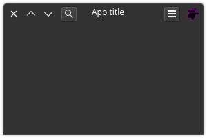

# QHeaderBar 

Inherits from [QFrame](https://doc.qt.io/qtforpython-6/PySide6/QtWidgets/QFrame.html)


## Overview

The main control area of an application window, where there are close, maximize 
and minimize buttons, along with a movement area and the application icon.

It's a regular widget and can be aligned wherever you want, not just at the top 
of the window, but also in other places like the middle or bottom if you're a 
psychopath.

## Class signature

<pre><small>QHeaderBar(main_window: QApplicationWindow[QtWidgets, QMainWindow])</small></pre>

### Parameters

  - **main_window**: Type `QApplicationWindow` (QtWidgets.QMainWindow)

    Just pass `self` which indicates the top-level window instance:

    
    self.headerbar = QHeaderBar(self)
    

## Methods

Only new ones. See the
[**QFrame** documentation](https://doc.qt.io/qtforpython-6/PySide6/QtWidgets/QFrame.html) 
for more.

- [add_widget_to_left](#add_widget_to_left)

- [add_widget_to_right](#add_widget_to_right)

- [control_buttons_side](#control_buttons_side)

- [lef_layout](#lef_layout)

- [right_layout](#right_layout)

- [set_left_control_buttons_visible](#set_left_control_buttons_visible)

- [set_move_area_as_enable](#set_move_area_as_enable)

- [set_right_control_buttons_visible](#set_right_control_buttons_visible)

- [set_text](#set_text)

- [set_window_icon](#set_window_icon)

- [text](#text)

### add_widget_to_left

Signature: `add_widget_to_left(widget: QWidget) -> None`

Parameter `widget`: `QWidget`

Adds a widget to the left side of the header bar (after the control buttons or 
window icon).

---

### add_widget_to_right

Signature: `add_widget_to_right(widget: QWidget) -> None`

Parameter `widget`: `QWidget`

Adds a widget to the right side of the header bar (before the control buttons 
or window icon).

---

### control_buttons_side

Signature: `control_buttons_side(self) -> str`

Window control buttons side. Return 'left' or 'right' string.

---

### lef_layout

Signature: `lef_layout() -> QHBoxLayout`

Gets the left layout of the header bar. It is the layout where widgets are 
added when using the `add_widget_to_left` method.

---

### right_layout

Signature: `right_layout() -> QHBoxLayout`

Gets the right layout of the header bar. It is the layout where widgets are 
added when using the `add_widget_to_right` method.

---

### set_left_control_buttons_visible

Signature: `set_left_control_buttons_visible(visible: bool) -> None`

Parameter `visible`: `bool`

Controls the visibility of the control buttons on the left side of the window. 
Setting this to `False` will hide them, and `True` will show them.

---

### set_move_area_as_enable

Signature: `set_move_area_as_enable(enable: bool) -> None`

Parameter `enable`: `bool`

Enable or disable the window moving area. The area does not disappear, it just 
does not respond to clicking and dragging the mouse cursor.

---

### set_right_control_buttons_visible

Signature: `set_right_control_buttons_visible(visible: bool) -> None`

Parameter `visible`: `bool`

Controls the visibility of the control buttons on the right side of the window. 
Setting this to `False` will hide them, and `True` will show them.

---

### set_text

Signature: `set_text(text: str) -> None`

Parameter `text`: `str`

Add text in the middle of the header bar. This is typically the text used as 
the window title.

---
### set_window_icon

Signature: `set_window_icon(icon: QIcon) -> None`

Parameter `icon`: `QtGui.QIcon`

A new icon to update the application icon

---

### text

Signature: `text() -> str`

Gets the text of the header bar. This is the text in the middle, normally used 
as the window title.

## Signals

**resize_event_signal** = QtCore.Signal(object)

## Changes

The `resize_event` method has been rewritten, so use the `resize_event_signal` 
signal, or consider using event-specific methods such as `event_filter`.

## Examples

Note that a central widget with appropriate settings already exists. As it is 
already accessed directly, there is no need to create one.

```python
self.central_widget().set_layout(self.main_layout)
```

Also note that the headerbar widget is independent, meaning you can place it 
wherever you want, which is why we aligned it at the top.

```python
self.main_layout.set_contents_margins(0, 0, 0, 0)
self.main_layout.set_alignment(QtCore.Qt.AlignTop)
```

This is the result:

```python
class Window(QtWidgetsX.QApplicationWindow):
    def __init__(self):
        super().__init__()

        self.main_layout = QtWidgets.QVBoxLayout()
        self.central_widget().set_layout(self.main_layout)

        self.main_layout.set_contents_margins(0, 0, 0, 0)
        self.main_layout.set_alignment(QtCore.Qt.AlignTop)

        self.headerbar = QtWidgetsX.QHeaderBar(self)
        self.main_layout.add_widget(self.headerbar)


app = QtWidgets.QApplication(sys.argv)
window = Window()
window.show()
sys.exit(app.exec())
```


### A more complete minimal example

In this example, we will add the `os` library to add an icon with a dynamic 
path. The icon, once configured in the window, will be automatically recognized 
by the header bar.

```python
SRC_DIR = os.path.dirname(os.path.abspath(__file__))
...

icon_path = os.path.join(SRC_DIR, 'icon.svg')
window_icon = QtGui.QIcon(QtGui.QPixmap(icon_path))
self.set_window_icon(window_icon)
```

The title is not automatically recognized by the header bar as in the case of 
the icon, because not in all use cases a window needs to have the title 
displayed. In our case, if we want to see the window title, we need to manually 
redirect it to the header bar.

```python
self.set_window_title('App title')
self.headerbar.set_text(self.window_title())
```

We also added a search button on the left side and a menu button on the right 
side of the header bar

```python
# Search button
self.search_button = QtWidgets.QToolButton()
self.search_button.set_icon(QtGui.QIcon.from_theme('search'))
self.headerbar.add_widget_to_left(self.search_button)

# Menu button
self.menu_button = QtWidgets.QToolButton()
self.menu_button.set_icon(QtGui.QIcon.from_theme('application-menu'))
self.headerbar.add_widget_to_right(self.menu_button)
```

This is the result:

```python
# !/usr/bin/env python3
import os
import sys

from PySide6 import QtCore, QtGui, QtWidgets
from PySideX import QtWidgetsX
from __feature__ import snake_case

SRC_DIR = os.path.dirname(os.path.abspath(__file__))
sys.path.append(SRC_DIR)


class Window(QtWidgetsX.QApplicationWindow):

    def __init__(self, *args, **kwargs) -> None:
        super().__init__(*args, **kwargs)

        # Window icon
        icon_path = os.path.join(SRC_DIR, 'icon.svg')
        window_icon = QtGui.QIcon(QtGui.QPixmap(icon_path))
        self.set_window_icon(window_icon)

        # Layout
        self.main_layout = QtWidgets.QVBoxLayout()
        self.main_layout.set_contents_margins(0, 0, 0, 0)
        self.main_layout.set_alignment(QtCore.Qt.AlignTop)
        self.central_widget().set_layout(self.main_layout)

        # Headerbar
        self.headerbar = QtWidgetsX.QHeaderBar(self)
        self.main_layout.add_widget(self.headerbar)

        # Window title
        self.set_window_title('App title')
        self.headerbar.set_text(self.window_title())

        # Search button
        self.search_button = QtWidgets.QToolButton()
        self.search_button.set_icon(QtGui.QIcon.from_theme('search'))
        self.headerbar.add_widget_to_left(self.search_button)

        # Menu button
        self.menu_button = QtWidgets.QToolButton()
        self.menu_button.set_icon(QtGui.QIcon.from_theme('application-menu'))
        self.headerbar.add_widget_to_right(self.menu_button)

        # Window size
        self.set_minimum_width(300)
        self.set_minimum_height(200)


if __name__ == '__main__':
    app = QtWidgets.QApplication(sys.argv)
    window = Window()
    window.show()
    sys.exit(app.exec())
```


