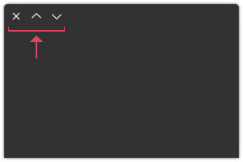

# QWindowControlButtons 

Inherits from [QFrame](https://doc.qt.io/qtforpython-6/PySide6/QtWidgets/QFrame.html)



## Overview

Widget with window control buttons, to close, maximize and minimize.

## Class signature

<pre><small>QWindowControlButtons(
    main_window: QApplicationWindow[QtWidgets, QMainWindow],
    button_order: tuple = (0, 1, 2))</small></pre>

### Parameters

  - **main_window**: Type `QApplicationWindow` (QtWidgets.QMainWindow)

    Just pass `self` which indicates the top-level window instance:

    
    self.control_buttons = QWindowControlButtons(self, (0, 1, 2))
    
  - **button_order**: Type `tuple`. Default is `(0, 1, 2)`

    In the button order parameter, each number represents a type of button: `0` 
    is the **minimize** button, `1` is the **maximize** button, `2` is the 
    **close** button and `3` is **window icon**.

## Methods

Only new ones. See the
[**QFrame** documentation](https://doc.qt.io/qtforpython-6/PySide6/QtWidgets/QFrame.html) 
for more.

### update_window_icon

Signature: `update_window_icon(icon: QIcon) -> None`

Parameter `icon`: `QtGui.QIcon`

A new icon to update the application icon

## Example

```python
self.control_buttons = QWindowControlButtons(self, (0, 1, 2))
self.layout.add_widget(self.control_buttons)
```
